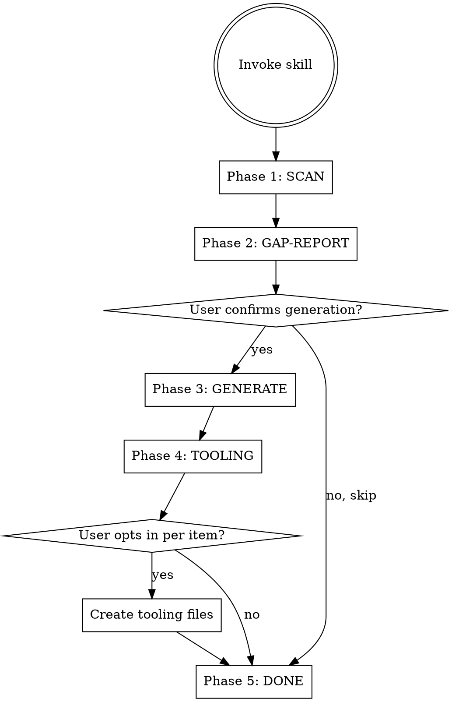
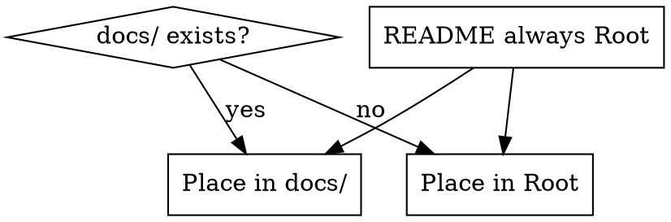

# project-excellence — Skill Design

## Overview

A Claude skill that audits new and existing repositories against the "GitNexus pattern": the principle that a repo should signal not just that someone built something, but that they thought about usage, maintenance, risk, contributors, and scaling.

The skill operates on three trust layers simultaneously:
1. **Produktklarheit** — sharp framing, two entry paths, real examples, honest limits
2. **Engineering-Reife** — visible quality: types, tests, lint, CI, pre-commit hooks
3. **Betriebsfähigkeit** — operational docs: architecture, runbook, contributing, changelog, roadmap

## Decisions Made

| Question | Decision | Rationale |
|---|---|---|
| New or existing projects? | Both — auto-detect | Maximizes applicability |
| Content generation | Derive from project + ask for gaps | Best balance of automation and accuracy |
| Language | Auto-detect from README/commits/package.json | Project-appropriate output |
| File placement | docs/ if exists, else Root (README always Root) | Respects existing conventions |
| CI/Tooling | Suggest with Opt-in per item | User stays in control |

## Skill Architecture

```
~/.claude/skills/project-excellence/
  SKILL.md                    # Main flow: phases, decision logic, triggers (~300 words)
  references/
    templates.md              # Document structure per file type (~400 words)
    gap-scoring.md            # ✓ / ⚠ / ✗ scoring criteria (~150 words)
    tooling-catalog.md        # CI/Hooks/Lint options with opt-in descriptions (~200 words)
```

**SKILL.md** contains only the flow. Heavy content lives in reference files, loaded only when needed.

## Phase Flow



## Phase Details

### Phase 1: SCAN

Reads the following sources to build a project model:

| Source | What to extract |
|---|---|
| `package.json` / `pyproject.toml` / `Cargo.toml` | Stack, scripts, dependencies, project name, description |
| `git log --oneline -30` | Activity, commit conventions (feat:/fix:/chore:) |
| `git remote -v` | Hosting, upstream |
| Existing docs (README, CONTRIBUTING, etc.) | What already exists, quality signal |
| Root folder structure (1 level deep) | Module layout, docs/ presence |
| Test files (`*.test.*`, `*.spec.*`, `e2e/`, `integration/`) | Test coverage signal |
| `.github/workflows/` | Existing CI |
| Language detection | Primary language from README + commit messages |

### Phase 2: GAP-REPORT

Outputs a table with all 7 document slots:

| Symbol | Meaning |
|---|---|
| ✓ | Exists and meets minimum quality bar |
| ⚠ | Exists but missing key sections |
| ✗ | Missing entirely |

The report groups findings by the three trust layers. Then asks: "Soll ich alle fehlenden/schwachen Dokumente generieren?"

### Phase 3: GENERATE

Creates only missing (✗) or weak (⚠) documents. Content derivation logic:

**README.md** (always Root)
- Problem: package.json description + first 30 lines of existing README
- Two entry paths: "Quick Try" (3 min) + "Production Use" (30 min)
- Examples: extracted from test files, example/ folder, code comments
- Limits: from TODO/FIXME comments, issue titles, or asked explicitly
- Language: detected in Phase 1

**ARCHITECTURE.md**
- Structure: root folder tree annotated semantically
- Data flow: derived from import chains and API definitions
- "Where to change what": one line per main module

**TESTING.md**
- Commands: from `scripts` in package.json / Makefile
- Test types: detected from file patterns (`*.test.*`, `*.spec.*`, `e2e/`, `integration/`)
- CI mapping: from `.github/workflows/` if present

**RUNBOOK.md**
- Common errors: from `fix:` commits (git log), ERROR comments in code
- Recovery: from scripts + existing README
- Fallback: 5 standard sections with placeholders + note to user

**CONTRIBUTING.md**
- Branching: inferred from branch name patterns (`feature/`, `fix/`, `hotfix/`)
- PR rules: from `.github/PULL_REQUEST_TEMPLATE.md` if present
- Conventions: from ESLint/Prettier/commitlint configs

**CHANGELOG.md**
- Last 20 commits grouped by `feat:` → Added, `fix:` → Fixed, `chore:` → Changed
- Keep-a-Changelog format

**ROADMAP.md**
- In progress: from open TODO/FIXME, recent PRs
- Recently done: from last 10 commits
- Out of scope: ask user explicitly (Opt-out: "skip this section")

### Phase 4: TOOLING

For each missing quality item, show:
- What it is
- What the user gains
- "Soll ich das aufsetzen?" — only creates files on Yes

**Tooling candidates:**
- `.github/workflows/quality.yml` — typecheck + lint on every PR
- `.github/workflows/tests.yml` — unit + integration tests on every PR
- `.github/workflows/e2e.yml` — E2E tests (suggest only if e2e/ folder found)
- `.pre-commit-config.yaml` — pre-commit hooks
- `eslint.config.*` — ESLint config (JS/TS projects)
- `.prettierrc` — Prettier config (JS/TS projects)

### Phase 5: DONE

Outputs:
1. Table of all created files with their paths
2. 3 concrete next steps for the user (e.g., "Fill in the Limits section in README.md", "Review ROADMAP.md and remove anything that's not planned")

## File Placement Logic



README.md is always written to the project root, regardless of docs/ presence.

## Language Detection Logic

Priority order:
1. `lang` field in package.json (rare but explicit)
2. Majority language of README.md headings and prose
3. Majority language of last 20 commit messages
4. Fallback: English

All generated documents use the detected language consistently.

## Gap Scoring Criteria

### README.md
- ✓ Has problem statement + Quick Start + at least one example
- ⚠ Exists but missing Quick Start OR has no examples OR no description of limits
- ✗ Missing or <10 lines

### ARCHITECTURE.md
- ✓ Has system overview + module list + data flow
- ⚠ Exists but reads like a folder listing without semantic explanation
- ✗ Missing

### TESTING.md
- ✓ Has local test commands + test type breakdown + CI mapping
- ⚠ Exists but only lists one command with no context
- ✗ Missing

### RUNBOOK.md
- ✓ Has ≥3 common errors with recovery steps
- ⚠ Exists but only has installation steps (not operational)
- ✗ Missing

### CONTRIBUTING.md
- ✓ Has setup + branching + PR rules + conventions
- ⚠ Exists but only says "open a PR"
- ✗ Missing

### CHANGELOG.md
- ✓ Follows Keep-a-Changelog with ≥1 version entry
- ⚠ Exists but informal / no structure
- ✗ Missing

### ROADMAP.md
- ✓ Has active work + recently done + explicit out-of-scope
- ⚠ Exists but only lists wishlist without prioritization
- ✗ Missing

## Out of Scope

- Generating application code or tests (only test infrastructure docs)
- Publishing to npm/PyPI or deployment automation
- Project management integrations (Linear, Jira, GitHub Projects)
- Modifying existing CI pipelines (only creates new workflow files if missing)

## Success Criteria

After the skill runs, someone reading the repo for the first time should be able to answer:
1. What does this do, for whom, and why should I trust it?
2. How do I try it in 3 minutes?
3. How do I run it in production?
4. How do I contribute without breaking things?
5. What's the quality signal (tests, CI, types)?
6. Where is this going?
